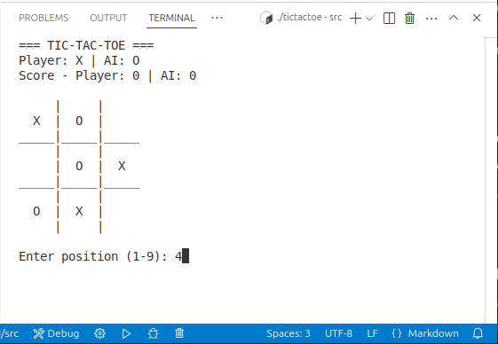
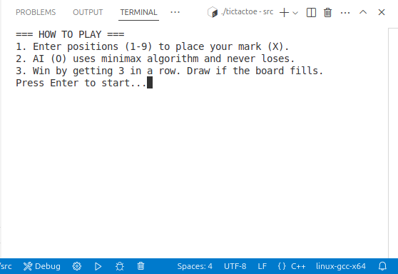
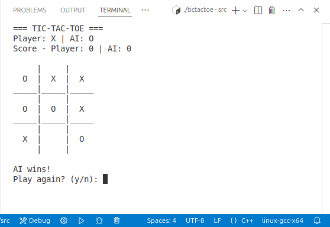
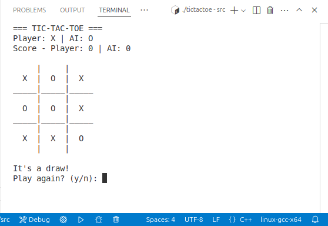

# 🎮 Tic-Tac-Toe with AI 👾  

A cross-platform console game featuring an **unbeatable AI** using the minimax algorithm.  
Tested on Windows, Linux, and macOS.  

  

---

## ✨ Features  
- 🧠 **Unbeatable AI** powered by the minimax algorithm  
- 📊 Dynamic score tracking (Player vs. AI)  
- 🖥️ Cross-platform support (Windows/Linux/macOS)  
- ✅ Robust input validation  
- 🔄 Play again option  

---

## 🚀 Getting Started  

### Prerequisites  
- **C++ Compiler**: `g++` (GNU Compiler Collection)  
  - **Windows**: Install [MinGW](http://www.mingw.org/)  
  - **Linux/macOS**:  
    ```bash  
    sudo apt install g++          # Debian/Ubuntu  
    brew install gcc              # macOS  
    ```  

### Clone the Repository  

# HTTPS  
git clone https://github.com/Rabby0501/Tic-Tac-Toe-AI.git  

# SSH  
git clone git@github.com:Rabby0501/Tic-Tac-Toe-AI.git  


🕹️ How to Run & Play: 

# Compile the code
   # Linux/macOS  
   g++ -o src/tictactoe src/tictactoe.cpp  
   ./src/tictactoe 

   # Windows  
   g++ -o src/tictactoe.exe src/tictactoe.cpp  
   .\src\tictactoe.exe

   # NB: After Compile the Windows .exe file Some this it can not run so you need to Give execute permission to the file.
   Open terminal and got to the folder where the main file and run this commend;

      chmod +x tictactoe.exe

   ## Executable File (`tictactoe.exe`)  
   A pre-compiled Windows executable is included for immediate gameplay.  
      
   1. Windows: src/tictactoe.exe (pre-compiled).

   2. Linux/macOS: Provide compilation instructions (no pre-built binary to ensure portability).

   3. Portability: Code tested on:s
      Windows 11 (MinGW)
      Ubuntu 22.04 (WSL/g++)
      macOS Ventura (Clang)

   # Run the Game
   # Linux/macOS
      ./src/tictactoe

   ## Windows
   1. Download `tictactoe.exe`.  
   2. Double-click the file or run via Command Prompt:   
         .\src\tictactoe.exe  

   # Pre-Compiled Executable
   A Windows executable (tictactoe.exe) is included in the src/ directory for immediate gameplay.

### 🧩 Game Rules:
 
 1. Enter 1-9 to place your mark (X) on the 3x3 grid:

   | 1 | 2 | 3 |
   -------------
   | 4 | 5 | 6 |
   -------------
   | 7 | 8 | 9 |

2. AI (O) responds instantly with its move
3. First to 3 in a row (horizontal/vertical/diagonal) wins!
4. Type y/n to play again or quit

### 📸 Screenshots:
1. Windows

2. Linux/macOS







### 📁 Project Structure:

📁 Tic-Tac-Toe-CPP/  
├── 📁 screenshots/          # Gameplay screenshots  
├── 📁 src/  
│   ├── 📄 tictactoe.cpp     # Source code  
│   ├── 📄 tictactoe        # Compiled executable (Linux/macOS)  
│   └── 📄 tictactoe.exe    # Compiled executable (Windows)  
├── 📄 .gitignore            # Git ignore rules  
├── 📄 README.md             # Documentation  
└── 📄 screenshot.png        # Sample gameplay screenshot  