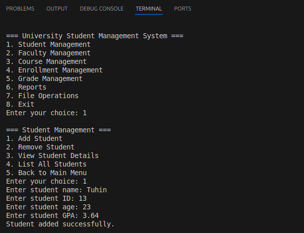

# University Management System
**University Management System** is a robust C++ console application designed to automate core academic operations. This system provides administrators with complete control over student records, faculty management, course scheduling, and gradebook maintenance through an intuitive terminal interface.

## Project Preview

  
   
  <em>Figure 1: Project Running in Terminal</em>

**Student Name**: TUHIN MD ABU HAMZA 
**Student ID**: 20233120013
**Course**: Programming Language and C++ Practice

## Features

### Core Functionality
| Feature                | Implementation Details |
|------------------------|------------------------|
| **Student Management** | CRUD operations with GPA tracking |
| **Faculty System**     | Specialization tracking & course assignment |
| **Course Engine**      | Enrollment management with capacity limits |
| **Gradebook**          | Secure grade entry with validation |
| **Reporting**          | Transcripts, rosters, and analytics |

**Technical Implementation**:
- Built using **standard C++17** with OOP principles
- Leverages STL containers (`vector`, `map`) for data management
- Implements polymorphic class hierarchy (Person → Student/Faculty)
- Features cross-platform file I/O operations
- Includes comprehensive input validation

**Academic Relevance**:
This project demonstrates mastery of:
1. Object-oriented design patterns
2. Memory-efficient data structures
3. File handling techniques
4. User interface design for terminal applications
5. Exception handling and data validation

**Target Users**:
- University registrars
- Academic advisors
- Department chairs
- Faculty administrators

## Project Run Instructions
./main