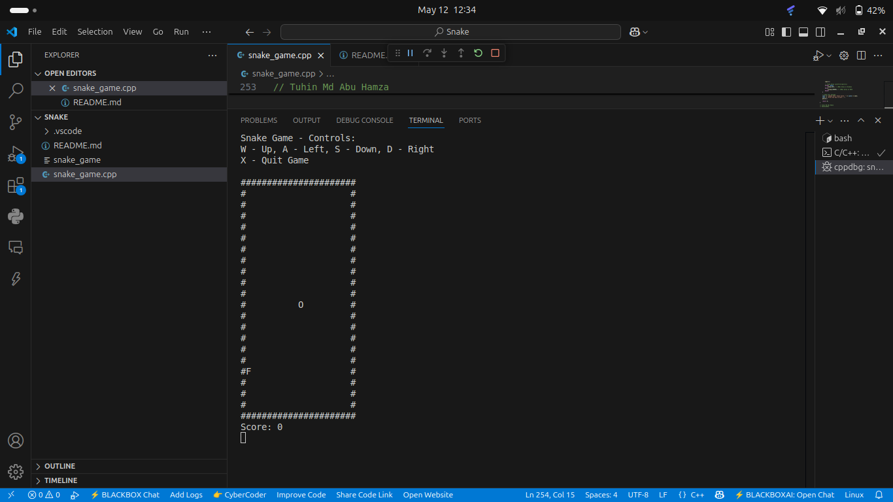

# Snake Game - C++ Console Implementation

## Game Preview

  
   
  <em>Figure 1: Snake Game Running in Terminal</em>

## Project Overview
This is a cross-platform Snake game implementation for the mid-term assignment of **Programming Language and C++ Practice** course at Yunnan University, School of Software.

**Name**: Tuhin Md Abu Hamza  
**ID**: 20233120013  
**Course**: Programming Language and C++ Practice (YN3012140116)

## Compilation Instructions

# Windows
g++ snake_game.cpp -o snake.exe -static-libgcc -static-libstdc++

# Linux/macOS
g++ snake_game.cpp -o snake