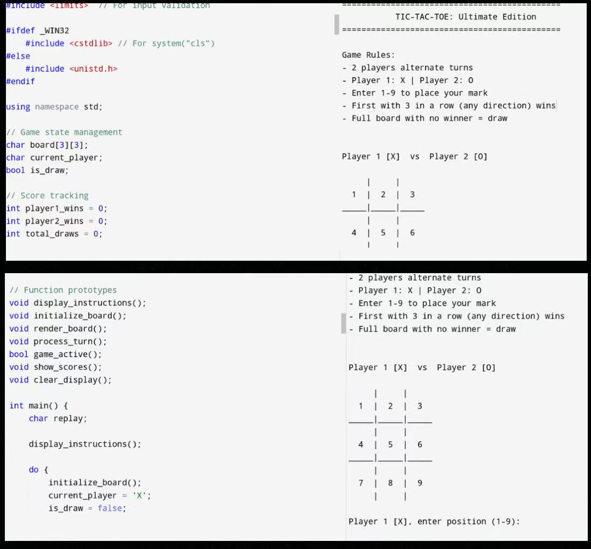

# Tic-Tac-Toe: Ultimate Edition

## Game Preview

  
   
  <em>Figure 1: Tic-tac-toe Game Running in Terminal</em>

## Overview
This is a simple, console-based Tic-Tac-Toe game developed as part of the Mid-Term Assignment for the Programming Language and C++ Practice course (YN3012140116).

## How to Play
- Two players alternate turns.
- Player 1 uses 'X', Player 2 uses 'O'.
- Enter a number between 1-9 to place your mark on the board.
- First to align three marks horizontally, vertically, or diagonally wins.
- If the board fills up without a winner, the game is a draw.

## Features
- Clear and friendly game instructions.
- Full input validation (prevents invalid moves).
- Dynamic screen clearing for better user experience.
- Leaderboard to track wins and draws.

## Cross-Platform
- Works on Windows, macOS, and Linux systems.
- Compiles with `g++`.
- To compile the program using g++:

    g++ -o tic_tac_toe tic_tac_toe.cpp

To run the executable:

    On Windows:
        tic_tac_toe.exe

    On Linux/macOS:
        ./tic_tac_toe

## Author
- badia aantar
- Yunnan University - 2025
