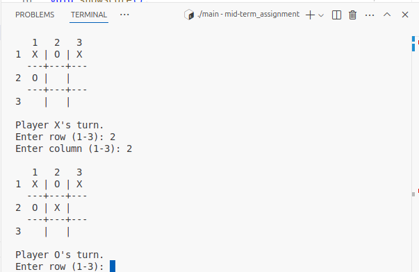

# Tic-Tac-Toe Game - C++ Console Implementation

## Game Preview
<p align="center">
  
  <br>
  <em>Figure 1: Tic-Tac-Toe Game Running in Terminal</em>
</p>

## Project Overview
This is a simple console-based implementation of the classic **Tic-Tac-Toe** game for two players. It was developed as part of the mid-term assignment for the **Programming Language and C++ Practice** course at Yunnan University, School of Software.

**Name**: MUGDHO MEHEDI HASAN 
**ID**: 20233120047
**Course**: Programming Language and C++ Practice (YN3012140116)

## Features
- Two-player mode (Player X and Player O)
- Real-time scoreboard tracking
- Input validation and error handling
- Option to play multiple rounds
- Clear text-based UI using the terminal

## How to Play
- Players take turns to enter a row and column number (1 to 3).
- The first player to align three of their marks (X or O) horizontally, vertically, or diagonally wins.
- If all cells are filled and no one wins, the game ends in a draw.
- After each game, players can choose to play again.

## Compilation Instructions

### Windows
```bash
g++ tic_tac_toe.cpp -o tic_tac_toe.exe -static-libgcc -static-libstdc++

### Linux/macOS
g++ tic_tac_toe.cpp -o tic_tac_toe

